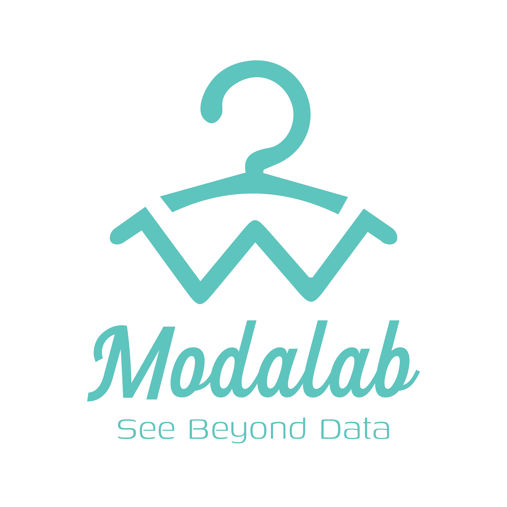

<p align="center"></a></p>

## Born To Survive — Fashion Business Data Analysis Dashboard

#### Mô tả:

-   Đây là một ứng dụng dashboard phân tích dữ liệu kinh doanh thời trang được xây dựng trên nền tảng Laravel (PHP). Mục tiêu của dự án là hiển thị các báo cáo, biểu đồ và bảng dữ liệu liên quan đến doanh thu, doanh số, khách hàng, cửa hàng và sản phẩm hàng đầu, phục vụ mục đích phân tích kinh doanh.
-   Ứng dụng bao gồm các chức năng chính: xác thực người dùng, trang dashboard tổng quan, trang quản lý khách hàng, báo cáo doanh thu, bảng xếp hạng sản phẩm/danh mục, và giao diện quản lý profile.

#### Ngăn xếp công nghệ chính:

-   Backend: PHP 8.x, Laravel
-   Frontend: Blade templates, vanilla JS, CSS (kèm Vite để build assets)
-   Database: SQLite/MySQL (cấu hình trong `.env`)
-   Build & quản lý gói: Composer, NPM/Yarn, Vite

#### Cấu trúc thư mục (tóm tắt):

-   `app/` — mã nguồn ứng dụng (Controllers, Models, Providers, ...)
-   `routes/` — định nghĩa route (`web.php`, `console.php`)
-   `resources/` — views, assets nguồn (JS/CSS)
-   `public/` — entry `index.php`, assets build sẵn
-   `database/` — migrations, seeders, dữ liệu giả
-   `storage/` — file lưu trữ, cache, logs
-   `config/` — cấu hình ứng dụng
-   `vendor/` — dependencies do Composer quản lý

#### Link Repository:

[\[LINK_REPOSITORY_HERE\]](https://github.com/Siegfried9533/Born-To-Survive---BTS---WebDev---IS207.Q13.git)

#### Hướng dẫn cài đặt & chạy (Chi tiết):

Dự án cung cấp các script tự động để khởi chạy nhanh chóng.

**Cách 1: Chạy nhanh với Script (Khuyến nghị)**

-   **Windows (CMD):** Chạy file `START_ALL.bat`
-   **Windows (PowerShell):** Chạy `.\START_ALL.ps1` (cần quyền admin hoặc set execution policy)
-   **Linux/Mac:** Chạy `./START_ALL.sh`

Script này sẽ tự động:
1. Cài đặt dependencies (NPM, Composer).
2. Tạo file `.env` và generate key.
3. Khởi chạy server Laravel và Vite.

**Cách 2: Cài đặt thủ công**

1.  **Chuẩn bị môi trường:**
    -   PHP >= 8.2
    -   Composer
    -   Node.js & NPM
    -   MySQL (hoặc SQLite)

2.  **Cài đặt Dependencies:**
    ```bash
    composer install
    npm install
    ```

3.  **Cấu hình môi trường:**
    -   Copy file `.env.example` thành `.env`:
        ```bash
        cp .env.example .env
        ```
    -   Generate App Key:
        ```bash
        php artisan key:generate
        ```
    -   Cấu hình thông tin Database trong file `.env`:
        ```env
        DB_CONNECTION=mysql
        DB_HOST=127.0.0.1
        DB_PORT=3306
        DB_DATABASE=ten_database_cua_ban
        DB_USERNAME=root
        DB_PASSWORD=
        ```

4.  **Cài đặt Cơ sở dữ liệu:**
    -   Chạy migration để tạo bảng và seed dữ liệu mẫu (Rất quan trọng để có dữ liệu ban đầu):
        ```bash
        php artisan migrate --seed
        ```
    -   Tạo symbolic link cho storage (nếu cần):
        ```bash
        php artisan storage:link
        ```

5.  **Khởi chạy ứng dụng:**
    -   Terminal 1 (Laravel Server):
        ```bash
        php artisan serve
        ```
    -   Terminal 2 (Vite Assets):
        ```bash
        npm run dev
        ```

6.  **Truy cập:**
    -   Mở trình duyệt tại: `http://127.0.0.1:8000`

#### Các lệnh hữu ích khác

-   **Build production:** `npm run build`
-   **Clear cache:**
    ```bash
    php artisan config:clear
    php artisan route:clear
    php artisan view:clear
    php artisan cache:clear
    ```

---

<p align="center"><a href="https://laravel.com" target="_blank"></a></p>

<p align="center">
<a href="https://github.com/laravel/framework/actions"></a>
<a href="https://packagist.org/packages/laravel/framework"></a>
<a href="https://packagist.org/packages/laravel/framework"></a>
<a href="https://packagist.org/packages/laravel/framework"></a>
</p>

## About Laravel

Laravel is a web application framework with expressive, elegant syntax. We believe development must be an enjoyable and creative experience to be truly fulfilling. Laravel takes the pain out of development by easing common tasks used in many web projects, such as:

-   [Simple, fast routing engine](https://laravel.com/docs/routing).
-   [Powerful dependency injection container](https://laravel.com/docs/container).
-   Multiple back-ends for [session](https://laravel.com/docs/session) and [cache](https://laravel.com/docs/cache) storage.
-   Expressive, intuitive [database ORM](https://laravel.com/docs/eloquent).
-   Database agnostic [schema migrations](https://laravel.com/docs/migrations).
-   [Robust background job processing](https://laravel.com/docs/queues).
-   [Real-time event broadcasting](https://laravel.com/docs/broadcasting).

Laravel is accessible, powerful, and provides tools required for large, robust applications.

## Learning Laravel

Laravel has the most extensive and thorough [documentation](https://laravel.com/docs) and video tutorial library of all modern web application frameworks, making it a breeze to get started with the framework. You can also check out [Laravel Learn](https://laravel.com/learn), where you will be guided through building a modern Laravel application.

If you don't feel like reading, [Laracasts](https://laracasts.com) can help. Laracasts contains thousands of video tutorials on a range of topics including Laravel, modern PHP, unit testing, and JavaScript. Boost your skills by digging into our comprehensive video library.

## Laravel Sponsors

We would like to extend our thanks to the following sponsors for funding Laravel development. If you are interested in becoming a sponsor, please visit the [Laravel Partners program](https://partners.laravel.com).

### Premium Partners

-   **[Vehikl](https://vehikl.com)**
-   **[Tighten Co.](https://tighten.co)**
-   **[Kirschbaum Development Group](https://kirschbaumdevelopment.com)**
-   **[64 Robots](https://64robots.com)**
-   **[Curotec](https://www.curotec.com/services/technologies/laravel)**
-   **[DevSquad](https://devsquad.com/hire-laravel-developers)**
-   **[Redberry](https://redberry.international/laravel-development)**
-   **[Active Logic](https://activelogic.com)**

## Contributing

Thank you for considering contributing to the Laravel framework! The contribution guide can be found in the [Laravel documentation](https://laravel.com/docs/contributions).

## Code of Conduct

In order to ensure that the Laravel community is welcoming to all, please review and abide by the [Code of Conduct](https://laravel.com/docs/contributions#code-of-conduct).

## Security Vulnerabilities

If you discover a security vulnerability within Laravel, please send an e-mail to Taylor Otwell via [taylor@laravel.com](mailto:taylor@laravel.com). All security vulnerabilities will be promptly addressed.

## License

The Laravel framework is open-sourced software licensed under the [MIT license](https://opensource.org/licenses/MIT).
